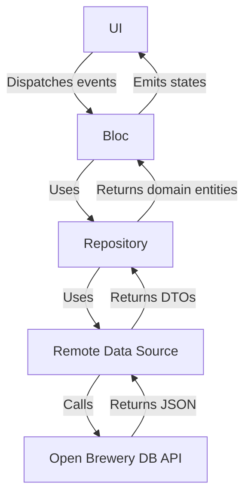
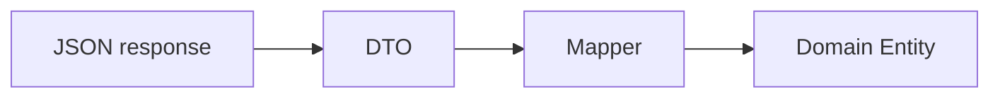

# Architecture

This document describes the architectural decisions made during the implementation of the technical challenge. It complements the README by providing additional implementation details.

## Overview

Brewery Explorer is organized using a layered, feature-first architecture.

The brewery feature is divided into Data, Domain and Presentation layers, while
shared infrastructure such as dependency injection, networking, navigation,
error handling and reusable widgets is located under `core`.

The main goals of this structure are:

- Keep UI, business logic and data access separated.
- Make dependencies explicit.
- Improve testability.
- Allow individual layers to evolve without tightly coupling them together.

## Implemented Features

- Brewery List
- Brewery Detail
- Infinite Scroll
- Debounced Search
- Retry Mechanism
- Error Handling
- Unit Testing

## Architecture

The application follows a unidirectional flow:

## Layer Responsibilities

### Presentation

The Presentation layer contains the application UI and state management.

Widgets dispatch events to the Blocs and rebuild in response to emitted states.
The Blocs coordinate user interactions such as initial loading, searching,
pagination and retry operations.

### Domain

The Domain layer defines the application models and repository contracts.

It does not depend on Flutter, Dio or the external API. This keeps the
application rules independent from infrastructure and implementation details.

### Data

The Data layer is responsible for communicating with the external API and
transforming the received data into Domain entities.

It contains:

- Remote data sources
- DTOs
- Mappers
- Repository implementations

### Core

The `core` directory contains infrastructure and components shared across the
application, including:

- Dependency injection
- Networking
- Navigation
- Error handling
- Reusable widgets

## Data Transformation Flow

The API response is transformed before reaching the Presentation layer.

