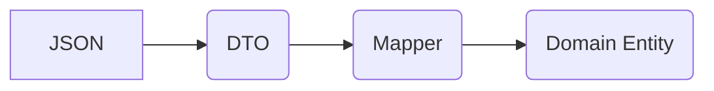
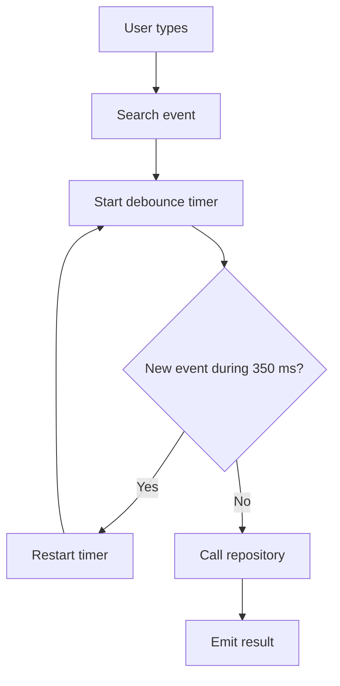
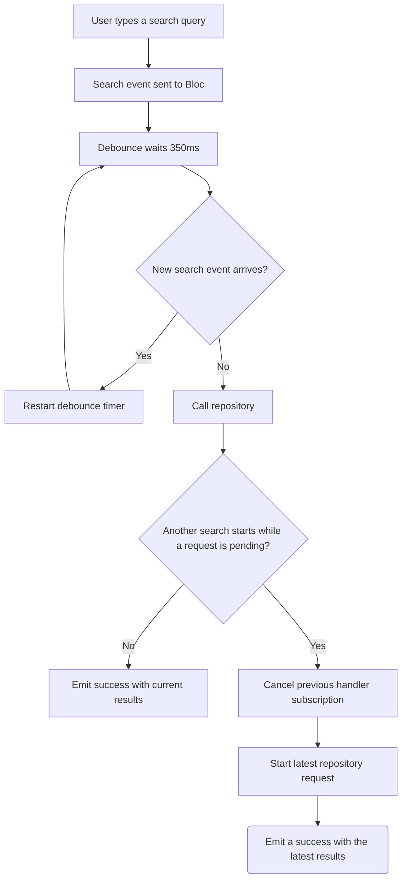

### Parsing Flow



### Debounce Flow



### Restartable Flow



## Folder Structure

```text
lib/
├── core/
│   ├── di/
│   ├── network/
│   ├── navigation/
│   ├── error/
│   └── widgets/
│
└── ui/
    └── features/
        └── breweries_list/
            ├── data/
            │   ├── datasources/
            │   ├── dtos/
            │   ├── mappers/
            │   └── repositories/
            │
            ├── domain/
            │   ├── entities/
            │   └── repositories/
            │
            └── presentation/
                ├── breweries_list/
                └── brewery_detail/
```

The project is organized by feature, with Data, Domain and Presentation responsibilities separated inside the brewery feature. Shared infrastructure and reusable widgets live in core.
